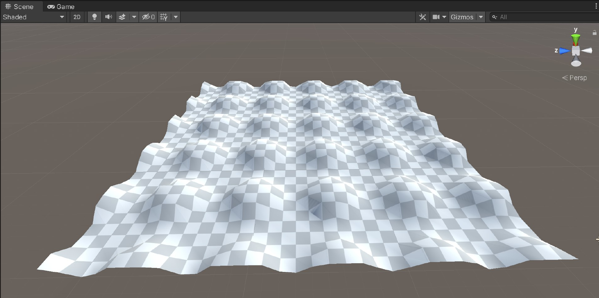

# Terrain Creation Example

This is a minimal project with an editor script that generates a terrain object and adds some structure to it to show how to change the terrain. 

The script is called via the menu GameObject > 3D Object > RetroMap.

The source code is in `Assets/Editor/CreateTerrain.cs`.
